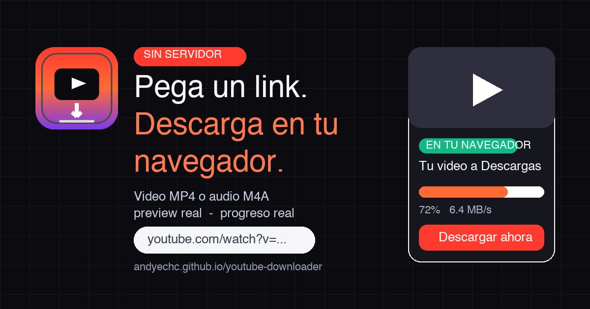
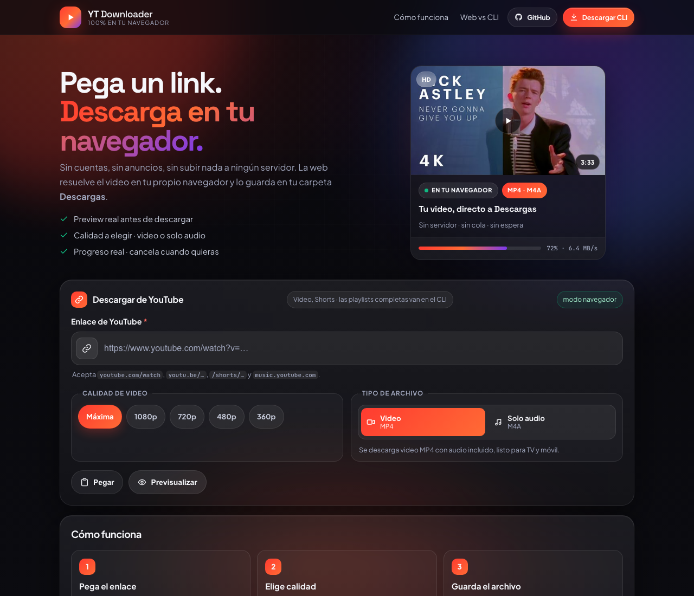
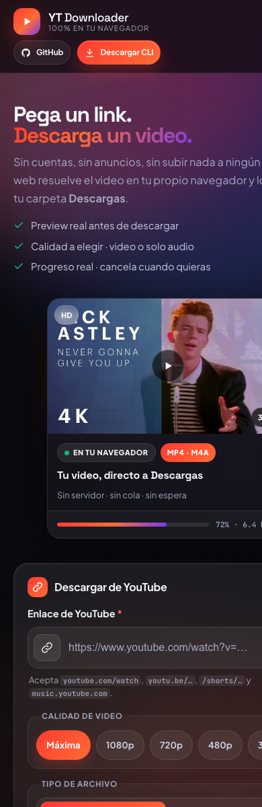

<div align="center">

# ⬇️ YT Downloader

**Pega un link. Descarga en tu navegador.**

Web local (sin cuentas, sin anuncios) + CLI en Python con `yt-dlp` para máxima calidad.

[](https://github.com/andyechc/youtube-downloader/releases)
[](youtube-downloader.py)
[](https://github.com/yt-dlp/yt-dlp)
[](LICENSE)

[⬇️ Descargar el CLI](https://github.com/andyechc/youtube-downloader/releases) · [🐞 Reportar fallo](https://github.com/andyechc/youtube-downloader/issues)



</div>

---

## ✨ Qué es

| | Web (local) | CLI (Releases) |
|---|---|---|
| 🏠 Dónde corre | Tu navegador, servida desde tu máquina | Tu terminal, binario único |
| 📥 Destino | Carpeta **Descargas** del navegador | Carpeta que elijas (`~/Downloads/YT`) |
| 🎬 Video | MP4 con audio, hasta 1080p | Máxima calidad + merge + 4K si existe |
| 🎵 Audio | M4A calidad original | **MP3 320kbps** (ffmpeg) |
| 📃 Playlists | Un video cada vez | **Completas** |
| 🔌 Instalación | Nada | Binario o `pip install -r requirements.txt` |

> La web usa la **misma lógica del CLI** (`QUALITIES`, resolución por altura, mejor stream muxed) portada a JavaScript. Si además ejecutas `python server.py` en local, la web lo detecta sola y desbloquea máxima calidad + MP3 + playlists (**modo local**).

## 🖼️ Capturas

<div align="center">

### Escritorio


### Móvil


</div>

## 🚀 Uso rápido

### Web — en local

```bash
./start-web.sh          # instala deps, chequea ffmpeg y abre http://127.0.0.1:8000
# o manual:
python3 -m http.server 8000 --directory web   # modo navegador puro
python server.py --open                        # modo local con yt-dlp (máxima calidad)
```

1. Pega un enlace (`youtube.com/watch`, `youtu.be/…`, `/shorts/…`, `music.youtube.com`)
3. Elige calidad (`Máxima / 1080 / 720 / 480 / 360`) y tipo (**Video MP4** o **Solo audio**)
4. **Previsualizar** → **Descargar en mi navegador** (con progreso real: %, velocidad y tamaño; `Ctrl/⌘ + Enter` también descarga)

### CLI — binario (recomendado)

Descarga el binario de tu SO en [**Releases**](https://github.com/andyechc/youtube-downloader/releases) (se publican solos con cada tag `v*`):

```bash
chmod +x youtube-downloader-macos   # Linux/macOS

# Guiado (menús con flechas ↑/↓)
./youtube-downloader-macos

# Directo
./youtube-downloader-macos "https://www.youtube.com/watch?v=VIDEO_ID" -q 720
./youtube-downloader-macos "https://..." -a                      # solo audio MP3
./youtube-downloader-macos "https://...playlist?list=..." -o mi_playlist
```

> Requiere **ffmpeg** (`brew install ffmpeg` · `sudo apt install ffmpeg` · `winget install ffmpeg`)
> y un runtime JS (`node`, `deno` o `bun`) para la extracción de formatos.

### CLI — desde código

```bash
python3 -m venv venv && source venv/bin/activate
pip install -r requirements.txt
python youtube-downloader.py "URL" -q 1080
```

| Flag | Descripción |
|------|-------------|
| `-o, --output` | Carpeta destino (default: `~/Downloads/YT`) |
| `-a, --audio` | Solo audio en MP3 320kbps |
| `-q, --quality` | `best`, `1080`, `720`, `480`, `360` (default: `best`) |

### Servidor local (modo pro, recomendado)

```bash
python server.py --open   # http://127.0.0.1:8000
```

La web detecta `/api/*` en el mismo origen y pasa a **modo local**: descargas con `yt-dlp` + `ffmpeg` en tu máquina (máxima calidad, MP3 320, playlists), y el navegador recibe el archivo igualmente.

> El servidor **no almacena nada**: cada archivo se borra del host en cuanto el navegador lo recibe (entrega one-shot; si cancelas a mitad, se conserva para reintentar).

## 🧠 Cómo funciona la web

```text
Navegador (servida en local)
 ├── 1. Valida el link y extrae el videoId (misma regex que el CLI)
 ├── 2. Preview:  Piped /streams/{id}  (failover) → Invidious → fallback oEmbed
 ├── 3. Selección: mejor muxed MP4 ≤ calidad  ·  mejor audio (mirror de resolve_quality)
 ├── 4. Descarga:  fetch → Blob → <a download>  (progreso real, cancelable)
 └── 5. Si detecta server.py en el mismo origen → usa /api/* (máxima calidad)
```

- **0 dependencias JS.** Solo HTML + CSS + `app.js` vanilla e iconos SVG inline.
- **Accesible:** `<form>` + `<fieldset>` + radios nativos, `aria-live`, foco visible, targets ≥ 44px, `prefers-reduced-motion`.
- **Honesto por diseño:** si el resolutor público falla (límites de las instancias gratuitas), la web lo dice y te lleva al CLI en vez de inventar datos.

## 🗂️ Estructura

```text
.
├── youtube-downloader.py   # CLI (guiado + flags, yt-dlp + ffmpeg)
├── server.py               # servidor local opcional (stdlib + yt-dlp)
├── requirements.txt        # yt-dlp
├── web/                    # UI web (se sirve en local)
│   ├── index.html          # UI (form accesible, preview, progreso, comparativa)
│   ├── style.css           # glass + responsive + reduced-motion
│   ├── app.js              # lógica del CLI portada a JS + modos navegador/local
│   ├── favicon.ico         # favicon (igual al logo)
│   ├── site.webmanifest
│   ├── 404.html
│   └── assets/             # icon.svg, icon-*.png, og.png
├── docs/                   # capturas del README
└── .github/workflows/
    └── release.yml         # binarios CLI → Releases (tag v*)
```

## 🛠️ Desarrollo

```bash
# Web en local (modo navegador puro)
python3 -m http.server 8000 --directory web

# Web + servidor (modo local con yt-dlp)
source venv/bin/activate && python server.py --open

# Logs: consola (INFO) + server.log rotativo (1MB x3, nivel DEBUG).
# Cambiar destino/nivel: python server.py --log-file /tmp/yt.log --log-level DEBUG

# Publicar CLI: taggea y los binarios se compilan solos
git tag v1.0.0 && git push origin v1.0.0
```

## ⚖️ Uso responsable

Proyecto para **uso personal** (tus videos, contenido libre o con permiso). Respeta los derechos de cada video y los [términos de YouTube](https://www.youtube.com/t/terms). El software se entrega "tal cual" ([MIT](LICENSE)).

---

<div align="center">

Hecho con ♥ por [@andyechc](https://github.com/andyechc) · `yt-dlp` + `ffmpeg` · Sin rastreadores

</div>
